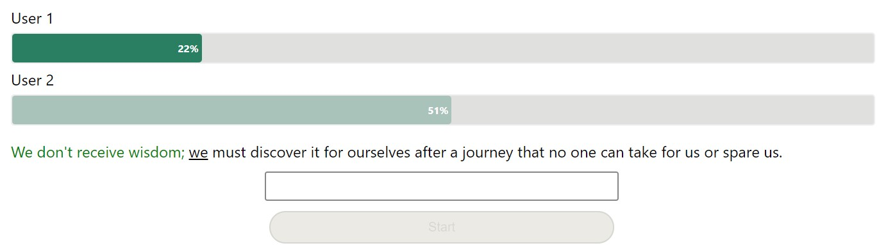

# TypeRacer Clone

# Functionality
## Flow
### If a user wants to create their own room:
* Navigate to root page (`/`);
* Enter desired username.
* App will create a randomly-generated room and navigate the user to that room (e.g `/O-kSCjMS`).
### If a user wants to join an existing room:
* Navigate to room page (e.g `/O-kSCjMS`)
* Enter desired username

## Text Input
* The text inside the input is **only** the current word the user is typing.
* The input is cleared once the app detects the *Space* key was pressed.

## Guided Text/Typer
* Four different indicators to help guide the user with the given text prompts.
1. Current word is underlined
2. Correctly typed letters are styled with green text.
3. Incorrectly typed letters are styled with red text.
4. The remaining letters of the text prompt are left untouched.